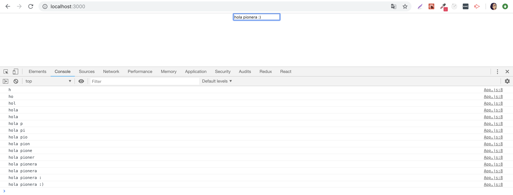
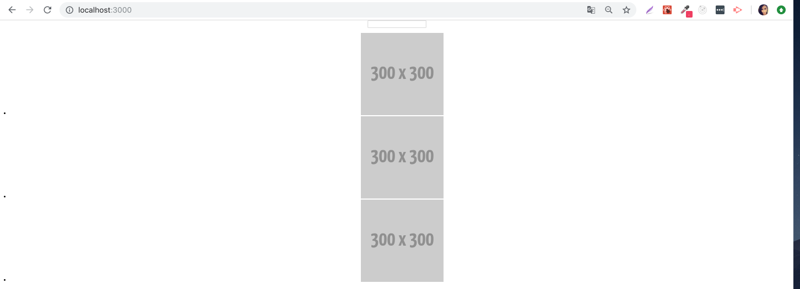

# 💜 PIOCAMP 2018 | Taller de React JS desde cero 💜

## ¿ Qué haremos ?

Un lindo buscador de GIFs 

## ¿ Qué aprenderemos ?

* Aprenderemos lo que se necesita para comenzar un proyecto con React JS.
* Qué son los componentes ?
* Conceptos de componentes: Functional & Logical.
* JSX (que en mi mente es como un hijito entre JS y HTML).
* Conceptos básicos de React JS: Props & State.
* Consumo de una API.
* Mostrar los datos consumidos en la UI y estilizarlos.

## ¿ Qué debemos hacer para comenzar ?

1. Instalar el boilerplate: `npm install -g create-react-app`.
2. Crear un proyecto nuevo: `npx create-react-app gif-search`.
3. Entrar al proyecto: `cd gif-search`.
4. Correr el proyecto: `npm start`.
5. Ir al navegador y ver que el proyecto corre: `http://localhost:3000/`.

Ahora siiiii, ¿ estás lista ? 

¡ Empecémos !

# 🔍 GIF SEARCH 🔍 

## Algunos conceptos importantes:

* _ReactJS:_ es una librería de JS para crear aplicaciones Web.
* _Webpack:_ es un paquete de activos que toma todos nuestros archivos JS / CSS, los combina en un solo archivo y sirve ese archivo. También incluye Hot Reloading, lo que significa que deberíamos ver cualquier cambio en el código sin tener que actualizar nuestro navegador.
* _Babel:_ es una herramienta de compilación que nos permite escribir código JavaScript ES2015 (también conocido comúnmente como ES6). 
* _ESLint:_ una utilidad de alineación de JavaScript que comprueba nuestro código JavaScript en busca de problemas de espaciado, errores, etc.

## Los componentes de nuestra aplicación son:


## App.js

Este componente es nuestro contenedor y será nuestro punto de partida. por ahora modificaremos el código que ya viene por defecto y le pondremos un lindo Hello World:

```
import React, { Component } from 'react';

import './App.css';

class App extends Component {
  render() {
    return (
      <div className="App">
        Hello World !
      </div>
    );
  }
}

export default App;
```
## SearchBar.js

Ahora, crearemos nuestro componente SearchBar para nuestra barrita de búsqueda dentro de una nueva carpeta src / components. Por ahora, solo pondremos un `div` para asegurarnos de que lo estamos introduciento en nuestro `App.js` de la manera correcta.

Entonces, nuestro SearchBar quedaría así:
```
import React from 'react';

class SearchBar extends React.Component {
    constructor() {
        super();
        this.state = { }
    }

    render() {
        return (
            <div>
                Seré una barrita de búsqueda :)
            </div>
        );
    }
}

export default SearchBar;
```
Y en App.js lo importamos así:
```
import React, { Component } from 'react';
import SearchBar from './components/SearchBar';

import './App.css';

class App extends Component {
  render() {
    return (
      <div className="App">
       Hello World !
       <SearchBar/>
      </div>
    );
  }
}

export default App;
```
Si en tu navegador ves el resultado correcto, escribiremos lo siguiente en SearchBar:
```
import React from 'react';

class SearchBar extends React.Component {
    constructor() {
        super();
        this.state = { term: '' }
    }

    onInputChange(term) {
        this.setState({term});
        this.props.onTermChange(term);
    }

    render() {
        return (
            <div className="search">
                <input onChange={event => this.onInputChange(event.target.value)} />
            </div>
        );
    }
}

export default SearchBar;
```
Y en el App.js:
```
import React, { Component } from 'react';
import SearchBar from './components/SearchBar';

import './App.css';

class App extends Component {
  handleTermChange(term) {
    console.log(term);
  }
  
  render() {
    return (
      <div className="App">
       <SearchBar onTermChange={this.handleTermChange}/>
      </div>
    );
  }
}

export default App;
```
Si todo sale bien, deberías ver esto en tu pantalla:


## El estado y nuestros Gifs

Si vemos nuestro mockup nuevamente:


Veremos que hay dos componentes diferentes que necesitaremos construir aquí: un GifList que se asigna a través de la matriz de gifs que recibiremos de la API de Giphy y un GifItem para procesar los gifs individuales.

Antes de que nos preocupemos por llamar a la API de Giphy, simulemos algunos datos falsos para pasarlos a nuestros componentes. 

Ve a tu App.js y escribe lo siguiente:
```
constructor() {
    super();

    this.state = {
        gifs: [
            {
                id: 1,
                url: 'http://fakeimg.pl/300/'
            },
            {
                id: 2,
                url: 'http://fakeimg.pl/300/'
            },
            {
                id: 3,
                url: 'http://fakeimg.pl/300/'
            }
        ]
    }
}
```
Ahora, creemos el componente `GifItem.js` en la carpeta components y le añadimos lo siguiente:
```
import React from 'react';

const GifItem = (image) => {
  return (
    <li>
      
    </li>
  )
};

export default GifItem;
```
Después, crearemos un componente llamado `GifList.js` en la carpeta components y escribimos lo siguiente:
```
import React from 'react';
import GifItem from './GifItem';

const GifList = (props) => {
  const gifItems = props.gifs.map((image) => {
    return <GifItem key={image.id} gif={image} />
  });

  return (
    <ul>{gifItems}</ul>
  );
};

export default GifList;
```
Y finalmente, importamos `GifList.js` en nuestro `App.js` y deberíamos tener lo siguiente:
```
import React, { Component } from 'react';
import SearchBar from './components/SearchBar';
import GifList from './components/GifList';

import './App.css';

class App extends Component {
  constructor() {
    super();

    this.state = {
        gifs: [
            {
                id: 1,
                url: 'http://fakeimg.pl/300/'
            },
            {
                id: 2,
                url: 'http://fakeimg.pl/300/'
            },
            {
                id: 3,
                url: 'http://fakeimg.pl/300/'
            }
        ]
    }
  }

  handleTermChange(term) {
    console.log(term);
  }

  render() {
    return (
      <div className="App">
       <SearchBar onTermChange={this.handleTermChange}/>
       <GifList gifs={this.state.gifs} />
      </div>
    );
  }
}

export default App;
```
En nuestro navegador, veremos:


