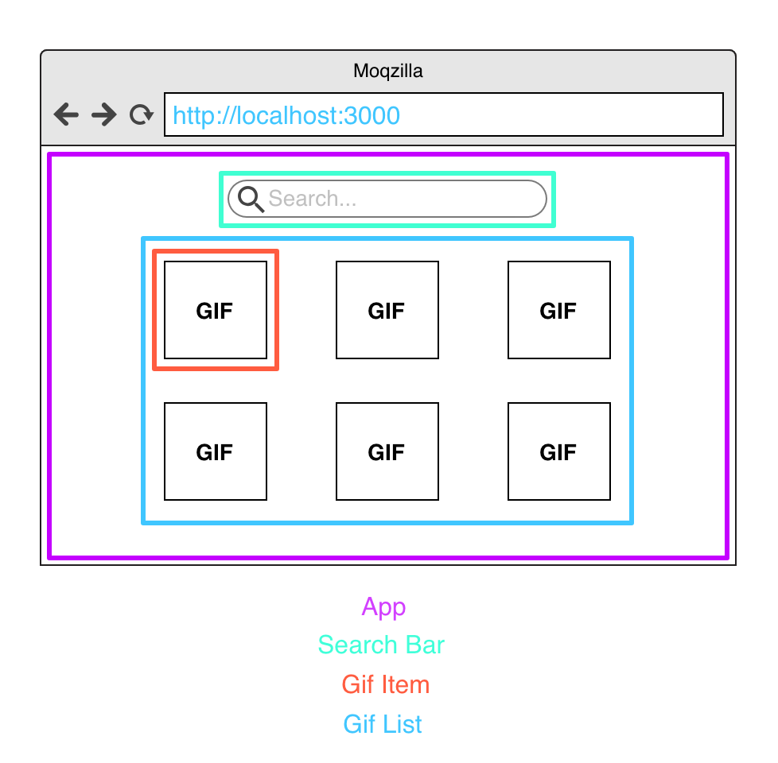

# 💜 PIOCAMP 2018 | Taller de React JS desde cero 💜

## ¿ Qué haremos ?

Un lindo buscador de GIFs 

## ¿ Qué aprenderemos ?

* Aprenderemos lo que se necesita para comenzar un proyecto con React JS.
* Qué son los componentes ?
* Conceptos de componentes: Functional & Logical.
* JSX (que en mi mente es como un hijito entre JS y HTML).
* Conceptos básicos de React JS: Props & State.
* Consumo de una API.
* Mostrar los datos consumidos en la UI y estilizarlos.

## ¿ Qué debemos hacer para comenzar ?

1. Instalar el boilerplate: `npm install -g create-react-app`.
2. Crear un proyecto nuevo: `npx create-react-app gif-search`.
3. Entrar al proyecto: `cd gif-search`.
4. Correr el proyecto: `npm start`.
5. Ir al navegador y ver que el proyecto corre: `http://localhost:3000/`.

Ahora siiiii, ¿ estás lista ? 

¡ Empecémos !

# 🔍 GIF SEARCH 🔍 

## Algunos conceptos importantes:

* _ReactJS:_ es una librería de JS para crear aplicaciones Web.
* _Webpack:_ es un paquete de activos que toma todos nuestros archivos JS / CSS, los combina en un solo archivo y sirve ese archivo. También incluye Hot Reloading, lo que significa que deberíamos ver cualquier cambio en el código sin tener que actualizar nuestro navegador.
* _Babel:_ es una herramienta de compilación que nos permite escribir código JavaScript ES2015 (también conocido comúnmente como ES6). 
* _ESLint:_ una utilidad de alineación de JavaScript que comprueba nuestro código JavaScript en busca de problemas de espaciado, errores, etc.

## Los componentes de nuestra aplicación son:



## App.js

Este componente es nuestro contenedor y será nuestro punto de partida. por ahora modificaremos el código que ya viene por defecto y le pondremos un lindo Hello World:

```
import React, { Component } from 'react';

import './App.css';

class App extends Component {
  render() {
    return (
      <div className="App">
        Hello World !
      </div>
    );
  }
}

export default App;
```

